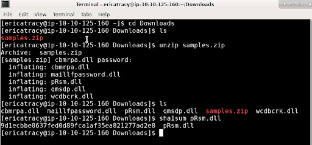
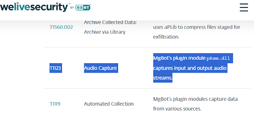
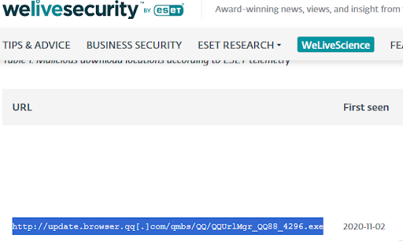
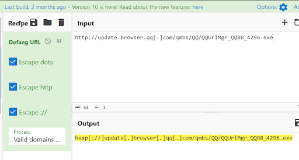
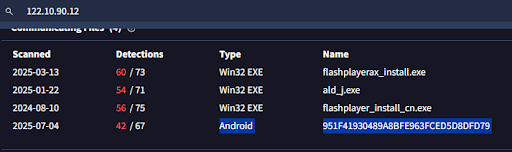
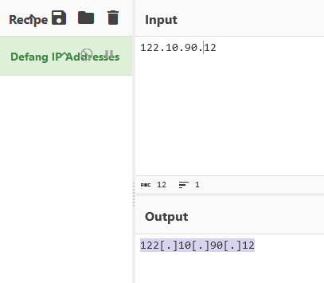

# 🧪 Friday Overtime – Malware Analysis & CTI Lab

This project simulates a real-world malware investigation scenario based on a TryHackMe lab. I acted as a Cyber Threat Intelligence (CTI) analyst responding to an urgent malware incident at a financial institution. The goal was to analyze a suspicious DLL sample, enrich IOCs, attribute the threat, and map behaviors using MITRE ATT&CK.

---

## 📝 Lab Summary

- **Scenario:** Simulated CTI response for SwiftSpend Finance  
- **Malware Type:** MgBot (modular RAT)  
- **APT Group:** Evasive Panda (aka BRONZE HIGHLAND)  
- **Target Platforms:** Windows (with Android linked activity)  
- **Skills Practiced:** Malware triage, threat attribution, MITRE mapping, IOC enrichment  

---

## 📂 File Analyzed

- `pRsm.dll` *(main focus of analysis)*  

  
*Extracted the DLL sample and generated its SHA1 hash.*

---

## 🔍 Key Artifact: `pRsm.dll`

- **SHA1 Hash:** `9d1ecbbe8637fed0d89fca1af35ea821277ad2e8`  
- **Confirmed As:** MgBot audio capture plugin  
- **Behavior:** Records microphone input  
- **Mapped MITRE Technique:** `T1123 - Audio Capture`  

  
*Attribution of `pRsm.dll` to the MgBot framework based on threat intel.*

---

## 🔗 IOC Enrichment

### ✅ Malicious Download URL

- **Original:**  
  `http://update.browser.qq[.]com/qmbs/QQ/QQUrlMgr_QQ88_4296.exe`  
- **Defanged (via CyberChef):**  
  `hxxp[://]update[.]browser[.]qq[.]com/qmbs/QQ/QQUrlMgr_QQ88_4296.exe`

   

  
*Located the malicious URL in public reporting.* 

 

  
*Used CyberChef to defang the URL for safe sharing.*

 

### ✅ Command & Control IP

- **IP Address:** `122.10.90[.]12`  
- **First Seen:** 2020-09-14  
- **Defanged:** `122[.]10[.]90[.]12`

  
*Used VirusTotal to investigate the C2 IP and related samples.*

 

  
*Defanged the IP address using CyberChef to ensure safe reporting.*

 

### ✅ Android Spyware Sample (Same C2 Infrastructure)

- **SHA1:** `951F41930489A8BFE963FCED5D8DFD79`  
- **Malware Family:** SpyAgent  
- **Platform:** Android  
- **First Seen:** June 2025  

---

## 🧠 MITRE ATT&CK Mapping

| Tactic       | Technique ID | Technique Name              | Description                          |
|--------------|--------------|-----------------------------|--------------------------------------|
| Collection   | T1123        | Audio Capture               | Microphone spying via plugin         |
| C2 (likely)  | T1071.001    | App Layer Protocol: Web     | Used for MgBot backdoor communication|

---

## 🛠️ Tools Used

- `unzip`, `sha1sum` (Ubuntu shell)  
- [VirusTotal](https://www.virustotal.com)  
- [CyberChef](https://gchq.github.io/CyberChef/)  
- [WeLiveSecurity APT Report](https://www.welivesecurity.com/)  
- [MITRE ATT&CK Navigator](https://attack.mitre.org/matrices/enterprise/)

---

## 🧘 Lessons Learned

- Malware sample handling and hashing  
- Open-source intelligence (OSINT) lookup techniques  
- Threat attribution using public APT reports  
- MITRE ATT&CK behavioral mapping  
- Infrastructure reuse across platforms (Windows & Android)  
- Safe reporting practices using CyberChef (defanging)

---

## 📎 Blog Post

👉 Full write-up: **[Friday Overtime – Malware Analysis Lab Blog Post](#)**  
*(Link coming soon)*  
