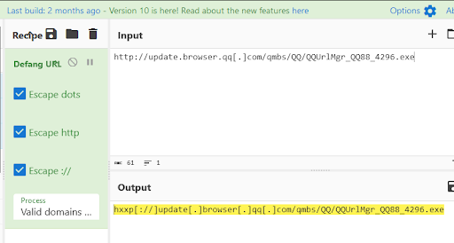
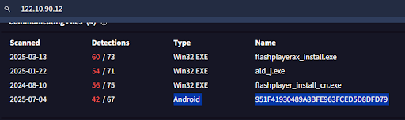
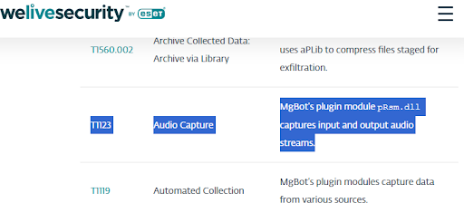

# 🧠 IOC Notes – Friday Overtime Malware Investigation

This file lists all the indicators of compromise (IOCs) identified during analysis of the `pRsm.dll` sample linked to MgBot malware used by the Evasive Panda APT group.

---

## 🔍 Hashes

| Filename        | SHA1 Hash                                 | Notes                                |
|-----------------|-------------------------------------------|--------------------------------------|
| pRsm.dll        | 9d1ecbbe8637fed0d89fca1af35ea821277ad2e8  | MgBot audio capture plugin           |
| Android Spyware | 951F41930489A8BFE963FCED5D8DFD79          | SpyAgent family, same infrastructure |

  
*Extracted and hashed pRsm.dll to confirm integrity and identify signature.*  

---

## 🌐 URLs (Defanged)

| Type           | URL                                                                  | Notes                   |
|----------------|-----------------------------------------------------------------------|-------------------------|
| Downloader URL | hxxp[://]update[.]browser[.]qq[.]com/qmbs/QQ/QQUrlMgr_QQ88_4296.exe   | Used to drop MgBot      |

  
*URL discovered via OSINT in WeLiveSecurity threat report.*  

  
*Used CyberChef to defang malicious URL for safe reporting.*  

---

## 🌍 IP Addresses (Defanged)

| IP Address        | First Seen   | Notes                                         |
|-------------------|--------------|-----------------------------------------------|
| 122[.]10[.]90[.]12 | 2020-09-14   | C2 server used for MgBot & SpyAgent activity  |

  
*Used CyberChef to defang IP address for safe documentation.*  

  
*Enriched C2 IP using VirusTotal — confirmed related Android threat.*  

---

## 🧩 Attribution

- Malware Family: **MgBot**  
- Threat Actor: **Evasive Panda (aka BRONZE HIGHLAND)**  
- Malware Function: Modular backdoor with plugin architecture  
- Plugin Analyzed: `pRsm.dll` – used for **audio capture**

  
*Public reporting confirmed SHA1 of pRsm.dll links to MgBot audio plugin.*  

---

_These IOCs are based on sample analysis, VirusTotal lookups, and OSINT from public CTI reports._
